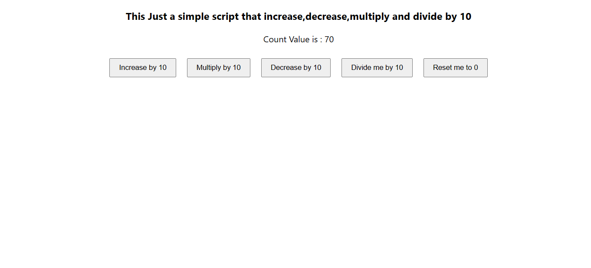

# Getting Started with Create React App

This project was bootstrapped with [Create React App](https://github.com/facebook/create-react-app).

## Overview
This Just a simple counter script that increase,decrease,multiply and divide by 10

## Usage Scripts

cd into  the project directory `cd tutorial`  and run `npm start`  or  `yarn start`:

Runs the app in the development mode.\
Open [http://localhost:3000](http://localhost:3000) to view it in your browser.

## How it should look like 

